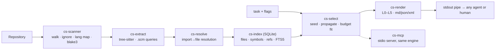

# ContextSlice

<p align="center">
  <a href="https://github.com/qwerpik/contextslice/actions/workflows/ci.yml"></a>
  <a href="LICENSE"></a>
  
  
  
</p>

<p align="center">
  <em>Deterministic, token-budgeted context selection for coding agents.</em>
</p>

<p align="center">
  tree-sitter parsing &nbsp;•&nbsp; SQLite index &nbsp;•&nbsp; bounded graph walk &nbsp;•&nbsp; no embeddings, no LLM, no network
</p>

<p align="center">
  <a href="#why-this-is-not-another-repo-packer">Why</a> •
  <a href="#project-status">Status</a> •
  <a href="#architecture-in-one-screen">Architecture</a> •
  <a href="#building">Building</a> •
  <a href="#design-commitments">Design</a> •
  <a href="docs/MASTER_PLAN.md">Master plan</a> •
  <a href="#contributing">Contributing</a>
</p>

> [!IMPORTANT]
> **Status: pre-alpha, bootstrap milestone.** The workspace, CI, and quality gates exist
> and are green. The selection engine is not implemented yet — see
> [Project status](#project-status). Nothing here is usable as a tool today.

Give it a task and a repository. It decides which files an agent should see, and at what
level of detail, and emits one token-budgeted artifact: full source where the work is,
declarations and skeletons where it matters, path-only entries for the rest.

```console
$ contextslice "fix the authentication timeout bug"
# → auth/session.go and auth/middleware.go in full,
#   declaration skeletons for auth/store.go and config/config.go,
#   path-only entries for the remaining 287 files,
#   ≈9.4k tokens instead of ≈310k.
```

The core is **deterministic and offline**: tree-sitter parsing, a symbol and reference
index in SQLite, per-language import resolution, and a bounded graph walk. No embeddings,
no LLM calls, no network, no API keys.

---

## Why this is not another repo packer

Whole-repository packing is a solved problem: Repomix, gitingest, code2prompt and
files-to-prompt do it well, and ContextSlice will lose that beauty contest on purpose
(MASTER_PLAN.md §3.6).

What is not solved is the question that actually costs an agent turns and tokens:

> For *this task*, which files, at what level of detail, within *N* tokens?

Three design commitments follow. **Two of them describe how the category already works, and
are stated that way on purpose** — the differentiation is narrower than a feature list, and
claiming otherwise would not survive contact with a knowledgeable reader. What is
distinctive is the *mechanism* in the third:

1. **Task-conditioned selection.** The task text drives seeding, and the repository graph
   refines it. This is **not** unique: Aider seeds from chat keywords and Graft's
   `graft ask` does deterministic task-conditioned ranking. Aider's repo map proved graph
   ranking works, and ContextSlice does not claim to have invented context selection.
2. **A budget that is fitted, not enforced.** Repomix's `--token-budget` documents itself
   as a CI guard: it exits non-zero when the pack overflows, but *the oversized output is
   still produced*. ContextSlice demotes detail levels until the artifact genuinely fits,
   and never exceeds the budget — property-tested against adversarial input.
3. **Level assignment as a global allocation, not a per-item fallback.** Mixed granularity
   in one artifact (full files, declaration skeletons, a path-only tree) is **also not
   unique** — Repomix offers per-file levels, Graft ships signatures-only output, and
   llm-router falls back to signatures when an item does not fit. What differs is the
   mechanism: those decide each item once, greedily, and never revisit it. ContextSlice
   assigns levels globally and demotes by gain-per-loss across all files, which is what
   makes hard invariants expressible (forced seeds never below L2, ≥3 files at ≥L2 when a
   seed exists, budget never exceeded).

Plus a **published, reproducible benchmark** — intrinsic (gold-context recall and precision
per token) and extrinsic (agent task success per token and cost) — sized by power
calculation, with the harness, corpus manifests and per-task logs published. Several
counterexamples exist (RepoGraph, Aider, ContextBench), so we make no "first" claim; we
make a checkability claim. No public claim ships without a run behind it, and the
benchmark's negative-results section is mandatory.

**A published negative result we take seriously.** arXiv 2602.11988 (June 2026) finds
that repository context files "do not generally improve task success rates, while
increasing inference cost by over 20% on average", and that *"repository overviews…
are not helpful"*. That is aimed at the premise of context injection, so it is recorded
as risk #4 in the master plan with a stop/go consequence rather than argued away. Two
consequences for how this project talks about itself: we do **not** pitch repository
overview (map mode is the empty-seed fallback, not the product), and Phase 3's extrinsic
benchmark is the real go/no-go — if task-conditioned selection shows no success
improvement at equal tokens, the project pivots to the flows where no agent-improvement
claim is needed. The study evaluates static overview files, not task-conditioned
selection of the files a change will touch; that distinction is a hypothesis to test,
not a rebuttal to cite.

**What is not unique, stated plainly.** Task-conditioned selection is table stakes:
Aider seeds from chat keywords, and Graft's `graft ask` does deterministic
task-conditioned ranking with no LLM. Graft also ships signatures-only output
(`graft skeleton`), and Repomix offers per-file inclusion levels. Mixed granularity as a
*capability* is therefore not the differentiator.

**Budget-driven granularity is also not unique** — we had to retract that claim too.
jCodeMunch and `llm-router` both emit an item at full source if it fits and fall back to
a signature if it does not. What none of them do is treat the budget as a **global
allocation problem**: llm-router is inclusion-first and greedy, deciding each item once at
the moment it is inserted and never revisiting it, so a large item admitted early is never
demoted to make room for a more relevant later one. Graft bounds by result *count*
(`--limit`); Repomix's levels are hand-declared globs; Aider's split is decided by chat
membership; SnapZip has no levels at all.

Our claim is therefore about the **mechanism**, and it is the weakest-sounding one we
could defend: every candidate is assigned a level, then demotion proceeds by
*gain-per-loss across all files*, subject to invariants a greedy fallback loop cannot
express — forced seeds never drop below L2, at least three files stay at ≥L2 when any seed
exists, and the rendered artifact never exceeds the budget. ADR-015 records how each
competitor was verified, and states plainly that this is "we could not find" rather than
"it does not exist".

There is **no patent moat here**. The defensive position is execution quality,
adapter depth, and accumulated evaluation data.

---

## Project status

<a id="project-status"></a>

This repository is at the **bootstrap milestone** (MASTER_PLAN.md §15 step 1). Being
explicit about what exists matters more than looking finished:

| Area | State |
|---|---|
| 📦 Cargo workspace, 10 crates (ARCHITECTURE.md §3) | ✅ exists, compiles |
| 🔍 `cs-scanner` — traversal, language detection, blake3 hashing | ✅ implemented and tested |
| 🌳 `cs-extract` — grammar loading, parse status, fact types | 🟡 grammar layer done and ABI-tested; `.scm` query extraction is step 3 |
| 🧭 `cs-resolve` — weight model, resolution types, `LanguageAdapter` seam | 🟡 types and seam defined; per-language resolvers are steps 4/10/11 |
| 🧩 `cs-index`, `cs-git`, `cs-select`, `cs-render`, `cs-bench`, `cs-mcp` | ⬜ skeleton (types only) |
| ⌨️ `cs-cli` — command surface, exit codes, stdout/stderr contract | 🟡 contract implemented; commands report their missing stage |
| 🛡️ CI: fmt, clippy `-D warnings`, tests on 3 OSes, MSRV, docs, licenses, zero-network | ✅ configured |
| 🧮 Selection algorithm (ALGORITHM.md) | ⬜ not implemented |
| 📊 Benchmark harness and published report | ⬜ not implemented |

> [!NOTE]
> The CLI is honest about this: a command whose stages do not exist yet **fails** with the
> roadmap step that will implement it, rather than printing an empty or partial slice. A
> caller can branch on the exit code; a caller cannot detect a plausible-looking wrong
> slice.

---

## Architecture in one screen

<a id="architecture-in-one-screen"></a>



<details>
<summary>Text fallback (screen readers / offline)</summary>

```text
Repository ─► cs-scanner ─► cs-extract ─► cs-resolve ─► cs-index (SQLite)
               walk,          tree-sitter    import→file     files/symbols/refs/
               ignore,        .scm queries   resolution,     edges/FTS5, content-hash
               lang map       defs/refs/      approximate     incremental, snapshots
               blake3         imports/sigs    symbol binding
                                              │
                task + flags ─► cs-select ─► slice plan ─► cs-render
                                seed/propagate/            L0–L5, md/json/xml,
                                levels/budget fit          anchors, elision
                                              │
                consumers:  stdout pipe ─► any agent or human
                            cs-mcp (stdio MCP server, thin over the same engine)
```

</details>

The full design is in [`docs/`](docs/):

| Document | Contents |
|---|---|
| 📌 [MASTER_PLAN.md](docs/MASTER_PLAN.md) | product, competitive position, MVP, roadmap, quality bar, risks |
| 🏛️ [ARCHITECTURE.md](docs/ARCHITECTURE.md) | crates, data model, storage, concurrency, failure modes, packaging |
| 🧮 [ALGORITHM.md](docs/ALGORITHM.md) | the selection algorithm: signals, weights, propagation, budget fitting |
| 📊 [BENCHMARK.md](docs/BENCHMARK.md) | evaluation methodology, metrics, baselines, statistical rules, claims policy |
| 🛡️ [SECURITY.md](docs/SECURITY.md) | threat model, prompt injection, untrusted repos, privacy, supply chain |
| 🌐 [LANGUAGES.md](docs/LANGUAGES.md) | language tiers, the adapter contract, per-language specs |
| 🗂️ [docs/adr/](docs/adr/) | decision records, including what verification rejected |

### Decisions already made and recorded

Sixteen ADRs exist before the first feature, because several were forced by facts that
contradicted the original plan. The interesting ones:

- **ADR-012 — we write our own tree-sitter queries.** Aider's tag queries were the
  obvious shortcut. They depend on `#strip!` and `#set-adjacent!`, which the core Rust
  binding **silently ignores** — the query compiles, captures come back unprocessed, and
  doc comments retain their `//` prefixes with no error anywhere. Measured, not assumed.
- **ADR-013 — MCP is deferred, and the protocol changed underneath us.** The current MCP
  revision (`2026-07-28`) *removed* the `initialize` handshake that our architecture
  document specified. `rmcp` also cannot serve stdio without an async runtime. The MCP
  adapter is a Phase 2 concern; the record explains what was verified and the criteria
  that will settle the transport choice.
- **ADR-008 — the TypeScript and TSX grammars are not interchangeable, and neither is a
  superset.** `LANGUAGE_TYPESCRIPT` cannot parse JSX; `LANGUAGE_TSX` cannot parse
  `<string>value` assertions. The grammar is chosen per extension, and a test pins it.
- **ADR-014 — `tiktoken-rs` with embedded tables**, so budget estimation and final
  measurement share one code path and stay offline.
- **ADR-015 — three competitive claims in our own founding documents were wrong.** They
  were checked against competitors' source rather than their documentation, and two of
  them disagreed: Aider's repo map is 1024–4096 tokens (not "~1k") with a *soft, ±15%*
  budget and granularity chosen by chat membership, and Graft already ships deterministic
  task-conditioned selection and signatures-only output. The claim that nobody publishes
  agent-outcome evaluation is **false** and withdrawn — RepoGraph (ICLR 2025) ablates a
  repo-context module on SWE-bench with released code, SWE-ContextBench compares shipped
  context tools on resolution rate and cost, ContextBench publishes Pass@1, and Aider has
  shipped a reproducible leaderboard for years. **Claims of absence are now forbidden** in
  any public artifact; we assert only what we measure.

---

## Building

<a id="building"></a>

Requires Rust **1.90** or newer. The floor comes from `tree-sitter` 0.27, and CI
verifies it on the declared toolchain rather than trusting the declaration (ADR-001).

```console
$ cargo build --workspace
$ cargo test --workspace
$ cargo clippy --workspace --all-targets --all-features -- -D warnings
$ cargo fmt --all --check
$ cargo run -p cs-cli -- --help
```

Run the full local gate — this is exactly what CI runs:

```console
$ make check
```

---

## Design commitments

<a id="design-commitments"></a>

These are not aspirations; each is enforced somewhere:

- **Determinism.** Same index snapshot + task + flags ⇒ byte-identical output
  (ALGORITHM.md §12). Parallel work is order-normalized before it can affect output. An
  index snapshot id is frozen into every slice header.
- **Budget integrity.** The rendered artifact never exceeds the budget, property-tested
  against adversarial inputs.
- **Zero network.** The core never opens a socket, and CI fails the build if a networking
  or async-runtime crate enters the dependency tree.
- **Honest approximation.** Reference edges are approximate by construction; unresolved
  imports are counted and published as a resolution rate rather than hidden.
- **No source text stored.** The index holds spans and signatures, never file contents.
- **stdout is sacred.** Only the artifact goes to stdout; progress and diagnostics go to
  stderr, so piping always works.

---

## Contributing

<a id="contributing"></a>

Language adapters are the ideal first contribution: self-contained, template-guided, and
verifiable by golden fixtures. See [CONTRIBUTING.md](CONTRIBUTING.md) and
[docs/LANGUAGES.md §8](docs/LANGUAGES.md).

Algorithm changes require a benchmark delta attached to the PR. Constants may not be
tuned by anecdote (ALGORITHM.md §13).

## License

Apache-2.0. See [LICENSE](LICENSE) and [ADR-007](docs/adr/ADR-007-apache-2-license.md).
